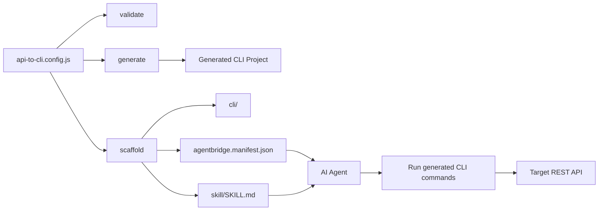
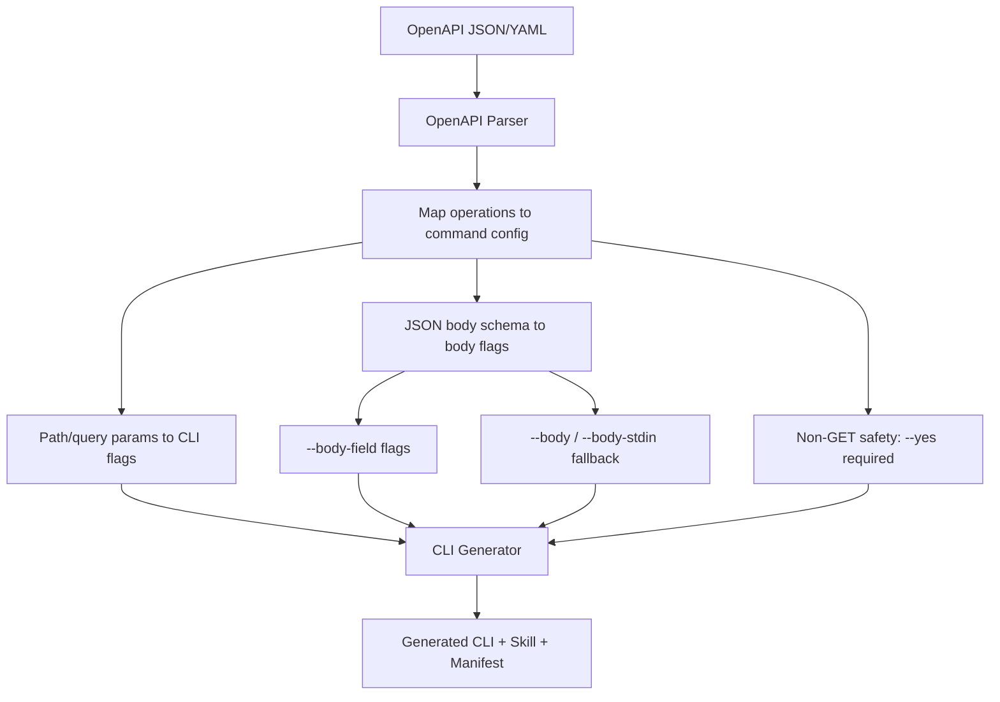

# AgentBridge (`api-to-cli`)

Generate AI-agent-friendly CLIs from API configs.

## What It Does
AgentBridge takes an API config and generates artifacts that an AI agent can use immediately:
- A JSON-first CLI project
- A `SKILL.md` file with usage instructions
- A machine-readable `agentbridge.manifest.json`

This means anyone can create a CLI layer for an API, even if the API owner never ships one.

## Current Scope
- Generator commands:
  - `validate`
  - `generate`
  - `scaffold`
- Generated CLI support:
  - GET, POST, PUT, PATCH, DELETE
  - JSON output by default
  - JSON error envelope
  - Env-var auth injection (`header` or `query`)
  - Safe guard for state-changing operations (`--yes` required)

## Install and Run

### Option A: Run with npx (no global install)

```bash
npx api-to-cli --help
```

### Option B: Install globally with npm

```bash
npm install -g api-to-cli
api-to-cli --help
```

## Core Commands

Use either `npx api-to-cli` or `api-to-cli` (if globally installed).

```bash
# 1) Validate from custom config
npx api-to-cli validate \
  --config ./examples/trello/api-to-cli.config.js

# 2) Generate from custom config
npx api-to-cli generate \
  --config ./examples/trello/api-to-cli.config.js \
  --output ./examples/trello/trelloapi-cli

# 3) Generate from OpenAPI spec (local file or URL)
npx api-to-cli generate \
  --spec ./examples/openapi/sample-openapi.yaml \
  --output ./examples/openapi/sample-openapi-cli

# 4) Generate a full agent bundle (CLI + skill + manifest)
npx api-to-cli scaffold \
  --config ./examples/trello/api-to-cli.config.js \
  --output ./examples/trello/trelloapi-agent
```

## Local Development

If you cloned this repo and want to run from source:

```bash
node ./bin/api-to-cli.js --help
```

## Scaffold Output Layout

```text
<output>/
  README.md
  agentbridge.manifest.json
  cli/
    package.json
    bin/<name>.js
    commands/*.js
    lib/client.js
    lib/output.js
    README.md
  skill/
    SKILL.md
```

## Architecture



## How AI Agents Use This
1. Agent reads `agentbridge.manifest.json` to discover commands, params, auth env vars, and install steps.
2. Agent reads `skill/SKILL.md` for operating rules and command examples.
3. Agent executes the generated CLI and parses JSON stdout/stderr.

## OpenAPI Notes
- Supported input: OpenAPI 3.x JSON or YAML (`--spec <path-or-url>`)
- Command names are derived from `operationId` when available, otherwise method + path
- Path/query parameters are converted into CLI flags
- For `POST/PUT/PATCH/DELETE`, generated commands require `--yes`
- If OpenAPI operation has JSON object requestBody, generated command creates typed body flags like `--body-name`
- Generated commands also support `--body <json>` and `--body-stdin` as fallback modes

## OpenAPI Architecture



## Sample OpenAPI Spec
- Included at `examples/openapi/sample-openapi.yaml`
- Includes GET and mutation operations with JSON request bodies
- Generated CLI output: `examples/openapi/sample-openapi-cli`
- Generated agent bundle output: `examples/openapi/sample-openapi-agent`

## Suggested Usage Flows

### Flow A: Local Personal Use (No API Owner Needed)
1. Write `api-to-cli.config.js` for the target API.
2. Run `scaffold`.
3. Set required auth env vars.
4. Let your agent use the generated CLI locally.

### Flow B: Team/Internal Use
1. Run `scaffold`.
2. Commit generated output to an internal repo.
3. Publish generated CLI to private npm registry (optional).
4. Point team agents to the shared skill + manifest.

### Flow C: Public Distribution
1. Generate CLI from API config.
2. Validate behavior, docs, and API ToS compliance.
3. Publish generated CLI package publicly.
4. Publish skill + manifest so agents can onboard automatically.

## Security Model
- Credentials are read from environment variables only.
- Generated CLIs do not persist credentials.
- Generated errors do not include auth headers or full URLs.
- Do not pass API keys/tokens as CLI flags.

## Example Config (Trello)
See `examples/trello/api-to-cli.config.js` for:
- query-based auth (`TRELLO_KEY`, `TRELLO_TOKEN`)
- path parameter endpoints
- generated command mapping

## Smoke Test

```bash
npm run test:smoke
```

This runs:
- `validate:trello`
- `generate:trello`
- `scaffold:trello`
- `validate:openapi`
- `generate:openapi`
- `scaffold:openapi`

## Notes
- Generated CLIs depend on `commander`.
- The generator currently targets CommonJS + Node runtime with `fetch` support.
- Planned next phases include MCP generation and OpenAPI input support.
